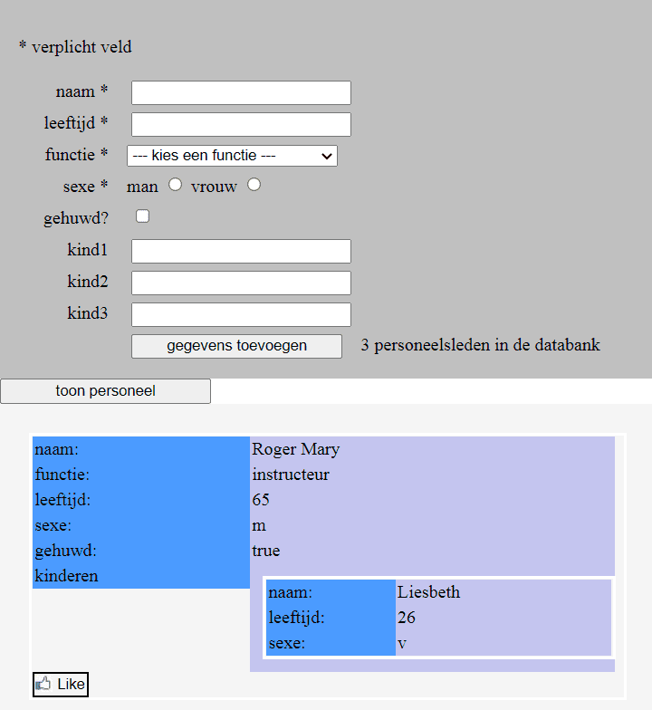

</a>

 
  
# JS-project-Personeel

Werken met de verschillende soorten "tabelvariabelen": Array en Object.

## Tech Stack

* HTML
* CSS
* JavaScript

  
## Gebruik:

* ingeladen gegevens om een personeelsbestand weer te geven
* een formulier om nieuwe gegevens aan het bestand toe te voegen

  
## Authors

:woman: [@marcelaos](https://github.com/marcela-os)
